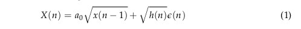
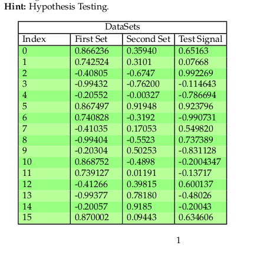

## Problem 1
>Find the maximum likelihood estimate of the unknown parameters, a0 , and c0 , for the
non-linear model of the random signal 
  
where: 
• h ( n ) = c 0 exp(x ( n )). 
• e ( n ) is zero mean unit variance uncorrelated Gaussian random signal.
## Problem 2
>We have two sets of signal (First Set & Second Set) and we need to select the best model
for each set from the following models, AR ( 5 ) , MA ( 4 ) , and ARMA ( 3, 4 ) . Now, for a
new test signal, we need to determine to which of the above models it belongs i.e. Does
it belong to the model of the First Set or the model of the Second Set?. 

